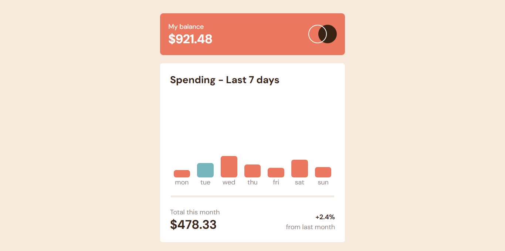

# Frontend Mentor - Expenses chart component


## Welcome! 👋

## The challenge

Your challenge is to build out this bar chart component and get it looking as close to the design as possible.

You can use any tools you like to help you complete the challenge. So if you've got something you'd like to practice, feel free to give it a go.

We provide the data for the chart in a local `data.json` file. So you can use that to dynamically add the bars if you choose.

Your users should be able to:

- [ x ] View the bar chart and hover over the individual bars to see the correct amounts for each day
- [ x ] See the current day's bar highlighted in a different colour to the other bars
- [ x ] View the optimal layout for the content depending on their device's screen size
- [ x ] See hover states for all interactive elements on the page
- [ x ] **Bonus**: See dynamically generated bars based on the data provided in the local JSON file

## Where to find everything

Your task is to build out the project to the designs inside the `/design` folder. You will find both a mobile and a desktop version of the design. 

The designs are in JPG static format. Using JPGs will mean that you'll need to use your best judgment for styles such as `font-size`, `padding` and `margin`. 

If you would like the design files (we provide Sketch & Figma versions) to inspect the design in more detail, you can [subscribe as a PRO member](https://www.frontendmentor.io/pro).

You will find all the required assets in the `/images` folder. The assets are already optimized.

There is also a `style-guide.md` file containing the information you'll need, such as color palette and fonts.

### Screenshot



## My process

### Built with

- Semantic HTML5 markup
- CSS custom properties
- Flexbox
- CSS Grid
- Mobile-first workflow
- [Tailwind](https://tailwindcss.com/) - CSS library

### What I learned

Use this section to recap over some of your major learnings while working through this project. Writing these out and providing code samples of areas you want to highlight is a great way to reinforce your own knowledge.

To see how you can add code snippets, see below:

```js
async function getJsonData() {
    try {
      const resposta = await fetch('data.json');

      if (!resposta.ok) {
        throw new Error('Was not possible to get the data');
      }
      const dados = await resposta.json();
      return dados;
    }
    catch {
      console.error('Erro', erro);
  }
}
```

### Useful resources

- [Fetch API](https://developer.mozilla.org/pt-BR/docs/Web/API/Fetch_API) - This helped me to get the json data.s

## Author
- Frontend Mentor - [@Liedson Franco](https://www.frontendmentor.io/profile/LiedsonFranco)
- Twitter - [@Liedson Franco](https://www.twitter.com/https://twitter.com/Liedson92163905)